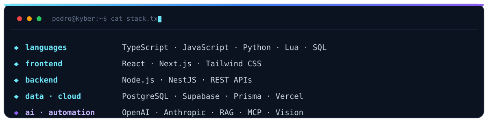

<!--
  Profile README for PedroLLou
  Custom self-hosted SVGs in /assets (no external services): header, stack, footer.
  Brand accent: #6EE7F9 on deep navy. Keep it distinctive, keep it yours.
-->

  

 

## 👤 `whoami`

Full-stack developer from Goiânia, Brazil, building products where the web meets applied AI.

- 🏢 Founder of **[Kyber Tech](https://somoskyber.com.br)**: my software company (websites, systems, automation and AI)
- 🚀 I ship **[Didata](https://usedidata.com.br)**, an AI platform that helps teachers work faster (Kyber's flagship, live in production)
- 🤖 Into applied AI and agentic tooling: I built an internal CRM with its **own MCP server** to run the business by chat
- 💻 Daily stack: TypeScript, React, Next.js, Node.js, Supabase and PostgreSQL
- 🎮 Off-hours: immersive **FiveM** roleplay worlds in Lua
- 📍 Goiânia, GO · open to remote

 

## 🧰 `stack`

 

## 🚀 `featured`

<table>
<tr>
<td width="50%" valign="top">

### 🌐 Didata &nbsp;<kbd>🚀 product</kbd>

**AI platform for teachers.** Kyber Tech's flagship, live in production. Generates lessons, activities, exams, photo-based grading and per-class reports with AI (RAG + vision).

 

</td>
<td width="50%" valign="top">

### 🤖 Kyber CRM &nbsp;<kbd>🔒 private</kbd>

Internal business platform with **its own MCP server (39 tools)** to run sales, finance, proposals and support by chat with AI. Multi-user with Postgres **Row Level Security** and Realtime.

</td>
</tr>
<tr>
<td width="50%" valign="top">

### 🏢 Kyber Tech &nbsp;<kbd>🏢 company</kbd>

**My software company.** Websites, systems, automation and AI for real clients. The site is built in Next.js and ships with an AI chatbot.

 

</td>
<td width="50%" valign="top">

### 🎮 Brava.gg &nbsp;<kbd>🔒 private</kbd>

A full **FiveM roleplay server** built with a **team of 3**. Spans the whole stack: in-game scripts and a rewards system in **Lua**, plus a web dashboard and public site in **TypeScript**.

</td>
</tr>
<tr>
<td width="50%" valign="top">

### 🏗️ Premium Construtora &nbsp;<kbd>client</kbd>

Institutional website for a construction company (public works in Goiás), delivered through Kyber Tech. Static site with SEO landing pages, live on its own domain.

 

</td>
<td width="50%" valign="top">

### 🎓 TCC: Skills Management

My graduation final project: a system to manage and evaluate the competencies of software professionals.

 

</td>
</tr>
</table>

 

## 📫 `connect`

 

⭐ Thanks for stopping by

